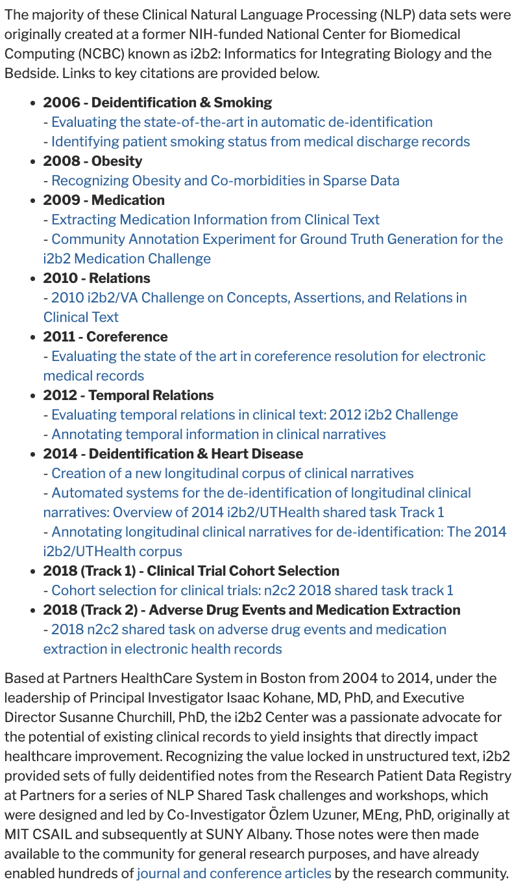

# medical-data-sets
A curated list of medical data sets that can be used for research

## MIMIC IV
MIMIC-IV is a relational database containing real hospital stays for patients admitted to a tertiary academic medical center in Boston, MA, USA. MIMIC-IV contains comprehensive information for each patient while they were in the hospital: laboratory measurements, medications administered, vital signs documented, and so on. The database is intended to support a wide variety of research in healthcare. MIMIC-IV builds upon the success of MIMIC-III, and incorporates numerous improvements over MIMIC-III.

To get access to data you need to first have a credentialed physionet account https://physionet.org/settings/credentialing/. The first step in credentialing is to complete this training here - https://physionet.org/about/citi-course/

## n2c2 NLP Research Data Sets
Unstructured notes from the Research Patient Data Registry at Partners Healthcare (originally developed during the i2b2 project)
<kbd>
  
</kbd>

## NCBI Data set
The majority of NCBI data are available for downloading, either directly from the NCBI FTP site or by using software tools to download custom datasets.    
https://www.ncbi.nlm.nih.gov/home/download/    
https://ftp.ncbi.nlm.nih.gov/    
Pub Med Central Database - https://www.ncbi.nlm.nih.gov/pmc/tools/textmining/    
